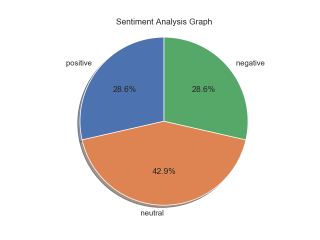

## Purpose
Our bot tracks the mood of your Slack channel in real time, and identifies for you where coworkers may not be particularly friendly. We are using a sentiment analysis algorithm from https://algorithmia.com, and each message's sentiment is rated according to that algorithm.

# Setup

First, clone the respository and enter it.
```
$ git clone <url>
$ cd SlackSentiment
```

Set up the virtual environment (with python 2.7!) and config file.
```
virtualenv -p /usr/bin/python2.7 .
source bin/activate
pip install -r requirements.txt
cp python-rtmbot-master/rtmbot.conf.example python-rtmbot-master/rtmbot.conf
```

Create a Slack Bot and get the API token here.
```
https://YOURWORKSPACEHERE.slack.com/apps/build/custom-integration
```

Create an Algorithmia account and get an API token here.
```
https://algorithmia.com/
````

Update python-rtmbot-master/rtmbot.conf with your API keys from Slack and Algorithmia.

```
DEBUG: True

SLACK_TOKEN: "YOUR_SLACK_TOKEN"
ALGORITHMIA_KEY: "YOUR_ALGORITHMIA_KEY"
```

Enter the python-rtmbot-master directory and run the rtmbot.
```
$ cd python-rtmbot-master
$ python rtmbot.py
```
Check your Slack channel, and your bot will appear online.

# Usage

The results from the analysis are in the form of:

* Negative
* Neutral
* Postitive

For more detail check out the algorithm's page https://algorithmia.com/algorithms/nlp/SocialSentimentAnalysis.

### Bot Commands
Currently there are three simple commands in the slack chatbox:

**NOTE**: commands are case sensitive.


**NOTE**: Slack bots can be invited to other channels and function as long as the files are running.


First,

```current mood?```

This command will display the current averages:

```
marvin BOT [7:45 PM]
Positive: 20.0%
Neutral: 60.0%
Negative: 20.0%
```


Second,

```bot function?```

This command will display what this bot is used for such as:

```this bot analyzes sentiments in the group```


Third,

```show graph?```

This command will display current averages as mentioned above with visuals such as a pie graph.
e.g





## Historical Analysis
Provided in the ```historical``` directory is a script that will review the last 24 hours of your Slack channel.

To run the historical analysis first you need your channel id. Running the following to get a list from your checkout directory.

```
$ python historical/channel_review.py -l

Channel Name    Slack ID
--------------  ----------
home            C0MUSFS49
random          C0ASDF34R
general         C056STSWB
```

Copy the id for the required channel and do the following:

```
$ python historical/channel_review.py -c C056STSWB
  %positive    %neutral    %negative
-----------  ----------  -----------
         30          48           22
```


## Automated Warnings
When running the slack bot if a person types a sensitive or foul language in the chat box such as:
"bloody hell" an automated message will pop up in the chat box:

```please refrain from using sensitive words!```

For list of all foul/senesitive keywords please refer to the ```bad_list.txt``` file in the ```python-rtmbot-master``` directory.
These words comprehenisve list of common sensitive words compiled by Google.

View the Demo Below 

[](https://www.youtube.com/watch?v=VCX8zWlBynQ)

